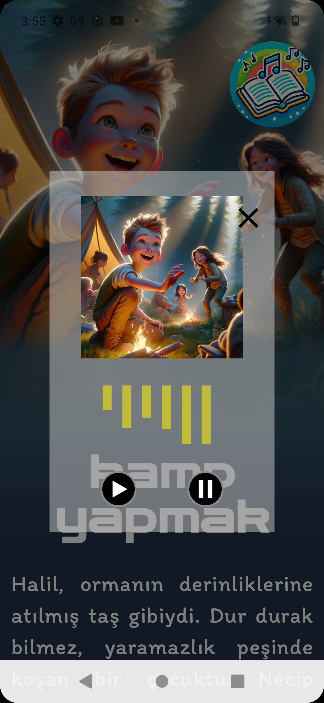

# DISCOVERY BOX
Discovery Box is an application developed using Kotlin in Android Studio. Discovery Box is an application that generates children's stories, converts them into audio and visuals, and also features educational games for children

Children's stories, games, and more.

  
  
  

Google login option

Separate login screens for stories and game

  
  

Ability to create and save any story you want

  
  
  

Save the story and listen to it again anytime you want

  
  

4 different game options:

Colors

Words

Numbers

Matching

  

Matching and color game

  
  

Words and number game

  
  

## Features

Create your own story by customizing it as you wish

Access your saved story anytime

Google-based personalized account

2 different language options: Turkish and English

4 different games (Words, Colors, Matching, and Numbers)

Each game has its own unique structure

## Technologies Used

- **Kotlin:** A modern language for Android app development.
- **Retrofit:** An HTTP client used for making and receiving REST API calls.
- **Glide:** A library for loading and caching image content.
- **Jetpack Compose:** A modern, fully declarative UI toolkit for building native Android applications. It simplifies UI development by using Kotlin, making it easier to create and manage interfaces with less boilerplate code. Compose allows you to design UIs by defining components and their states in a more intuitive and flexible way compared to traditional XML-based UI development.
- **Coroutines:** A modern approach for asynchronous operations.
-  **OpenAI and Gemini API:** Used for generating content like stories, text-to-speech, and images.
- **Firebase Authentication:** Used for user login and registration.
- **LiveData:** A lifecycle-aware data holder used to observe data changes.
- **MVVM (Model-View-ViewModel):** A design pattern used for application architecture.

